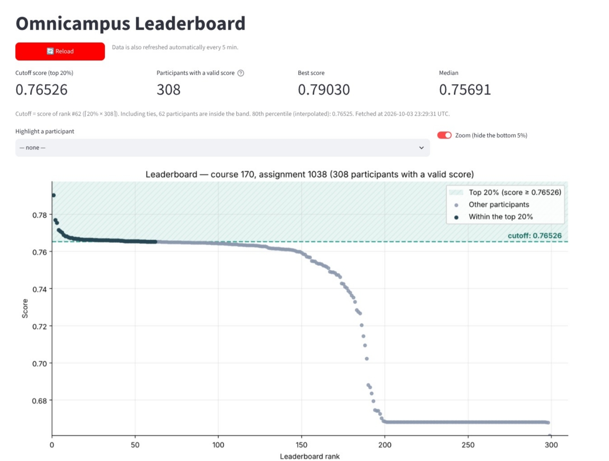

# Omnicampus Leaderboard

A small web app that shows the **live leaderboard** of an Omnicampus competition. It also shows the **score you need to be in the top 20%**.

The official leaderboard is a plain list of names and scores. This app reads that list, plots every participant on one chart, hatches the top-20% band and computes the cutoff score, so you can see where everyone stands without scrolling through hundreds of rows.



---

## Reading the leaderboard

### The cards

| Card | Meaning |
|---|---|
| **Top 20% cutoff** | Minimum score to be inside the top 20% right now. The rank it comes from is shown below the value. |
| **Participants** | Number of participants with a valid score. Failed submissions are ignored and counted below the value. |
| **Best score** | Highest score on the leaderboard and who holds it. |
| **Median score** | Half of the participants are above this score and half below. Also shows how many people are inside the top band. |

### The chart

- **X axis:** leaderboard rank (1 = first place).
- **Y axis:** score.
- **Blue dots:** participants inside the top 20%.
- **Gray dots:** everyone else.
- **Hatched band and dashed line:** the top-20% zone and its cutoff score.
- **Orange dot:** the participant picked in **Find a participant**. The app also says their rank and how far they are from the cutoff.
- **Zoom toggle:** hides the bottom 5% of scores, so the competitive part of the curve gets more room. Turn it off to see every valid score.

### How the cutoff is calculated

```
N      = number of participants with a valid score (score ≥ 0)
k      = ceil(0.20 × N)
cutoff = score of the participant ranked #k
```

- **Ties count:** anyone whose score equals the cutoff is also inside the band, so the band can hold slightly more than *k* people.
- **Invalid scores are excluded:** negative scores, such as `-999` for a failed submission, don't enter the calculation.
- **Percentile for reference:** the interpolated 80th percentile appears in the note below the cards. It can differ from the cutoff in the last decimal places.

### The table tab

The **Table** tab lists every entry with its rank, participant, score, status, number of submissions and timestamps. A checkbox column marks who is in the top 20%. **Download CSV** exports the whole table.

### Freshness

- **Reload:** fetches the leaderboard immediately.
- **Automatic refresh:** the app re-reads the leaderboard every 5 minutes.
- **Timestamp:** the last update time is shown in UTC.

---

## How it works

The Omnicampus leaderboard requires a login. The app does what a logged-in browser does:

1. It opens the leaderboard page with a session cookie and reads the access token that the page embeds in `__NEXT_DATA__`.
2. It calls the JSON endpoint `GET /api/v3/courses/<course>/assignments/<assignment>/leader-board` with `Authorization: Bearer <token>`.
3. It loads the response into a **pandas** DataFrame, computes the cutoff and draws the chart with **matplotlib**.
4. It serves the result with **Streamlit**.

Visitors never log in. The credential lives only on the server.

---

## Run locally

```bash
pip install -r requirements.txt
cp .streamlit/secrets.toml.example .streamlit/secrets.toml   # then fill in OMNI_COOKIE
streamlit run app.py
```

### Getting `OMNI_COOKIE`

1. Log in at <https://edu.omnicamp.us> and open the leaderboard.
2. Open the developer tools. Use **F12** in Chrome or Edge, and **Ctrl+Shift+I** in Opera (**Cmd+Option+I** on Mac).
3. Go to **Network**, reload the page and click the `leader-board/` request of type *document*.
4. Under **Request Headers**, copy the value of `cookie:`. It must contain `appSession=…`.
5. Paste it inside single quotes: `OMNI_COOKIE = '…'`.

When the session expires, the app shows **"Authentication failed"**. Copy a fresh cookie and update the secret.

---

## Deploy (Streamlit Community Cloud, free)

1. Push this repository to GitHub. Never commit `.streamlit/secrets.toml`; `.gitignore` already excludes it.
2. Open <https://share.streamlit.io>, click **Create app** and fill in:
   - **Repository:** this repository
   - **Branch:** `main`
   - **Main file path:** `app.py`
3. Under **Advanced settings**, set **Python 3.12** and paste `OMNI_COOKIE = '…'` into **Secrets**.
4. Click **Deploy**, then share the `https://<name>.streamlit.app` link.

---

## Configuration

All settings are read from Streamlit secrets or environment variables.

| Key | Default | Description |
|---|---|---|
| `OMNI_COOKIE` | — | Cookie header of a logged-in session (recommended). |
| `OMNI_ACCESS_TOKEN` | — | Alternative to the cookie: a raw JWT, valid for about 24 h. |
| `OMNI_COURSE_ID` | `170` | Omnicampus course ID. |
| `OMNI_ASSIGNMENT_ID` | `1038` | Assignment (competition) ID. |
| `TOP_FRACTION` | `0.20` | Size of the top band (0.10 = top 10%). |
| `SHOW_NAMES` | `true` | Set to `false` to hide participant names. |
| `FOOTER_AUTHOR` | `ricardomonteiro` | Name shown in the footer. |
| `CACHE_TTL_SECONDS` | `300` | Automatic refresh interval in seconds. |

---

## Project structure

```
omnicamp-leaderboard/
├── app.py                         # scraper, analysis, chart and UI
├── requirements.txt               # Python dependencies
├── README.md
├── .gitignore                     # keeps secrets out of Git
└── .streamlit/
    ├── config.toml                # theme
    └── secrets.toml.example       # template for credentials
```

---

## Notes

- **Protect the cookie.** It grants access to the Omnicampus account it came from. Keep it only in Streamlit Secrets, and never paste it in issues, chats or commits.
- **Ask before republishing.** The original leaderboard is visible only to logged-in participants, so check with the course organizers first. Set `SHOW_NAMES = "false"` to publish scores without names.
- **Polite request rate.** The app requests the leaderboard at most once every 5 minutes, plus manual reloads.
- **Unofficial.** This project is not affiliated with Omnicampus.

---

<p align="center">Courtesy of <b>ricardomonteiro</b></p>

<p align="center">
  <a href="https://www.python.org/"></a>
  <a href="https://streamlit.io/"></a>
  <a href="https://pandas.pydata.org/"></a>
  <a href="https://matplotlib.org/"></a>
  <a href="https://numpy.org/"></a>
  <a href="https://requests.readthedocs.io/"></a>
  
  <a href="LICENSE"></a>
  <a href="https://leaderboard-ominicamp.streamlit.app"></a>
</p>
